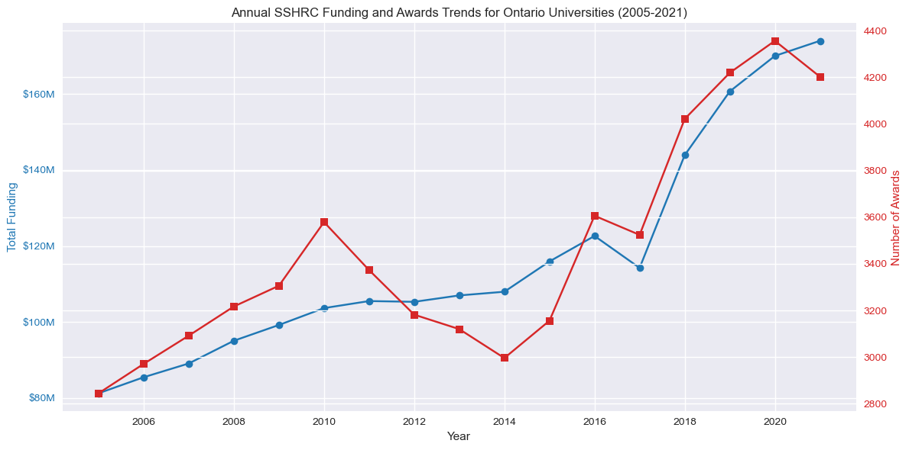
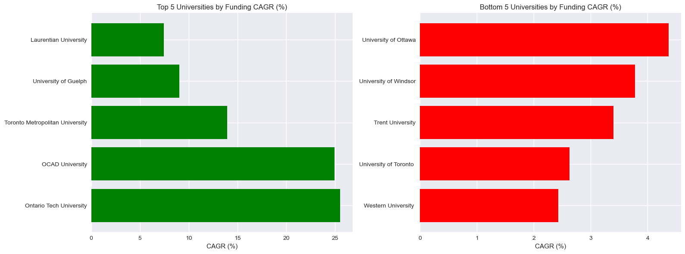
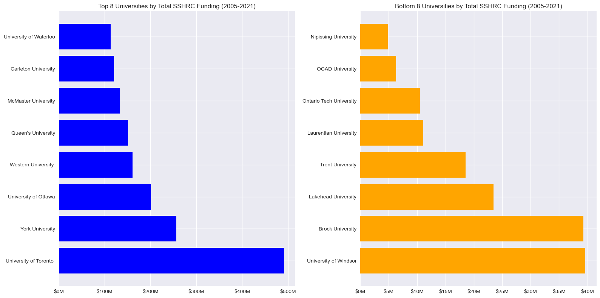
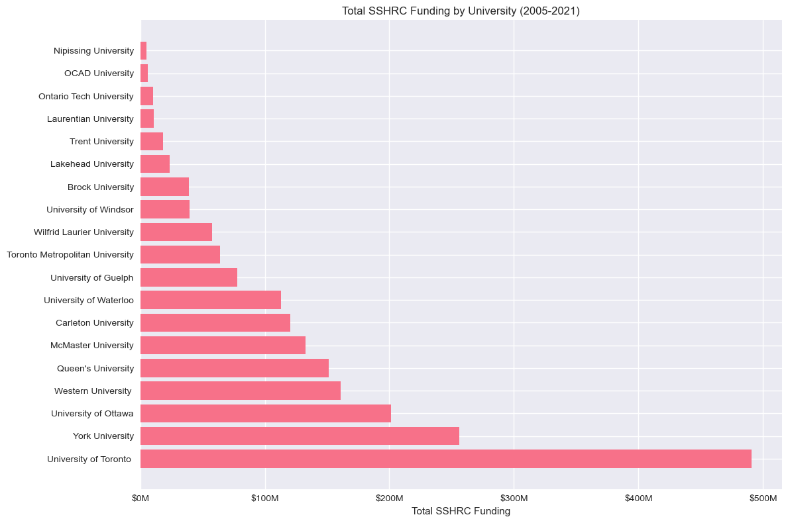
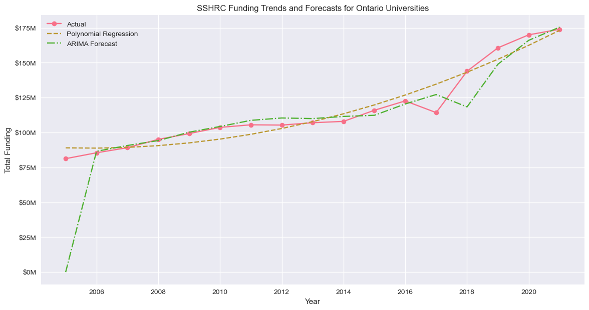
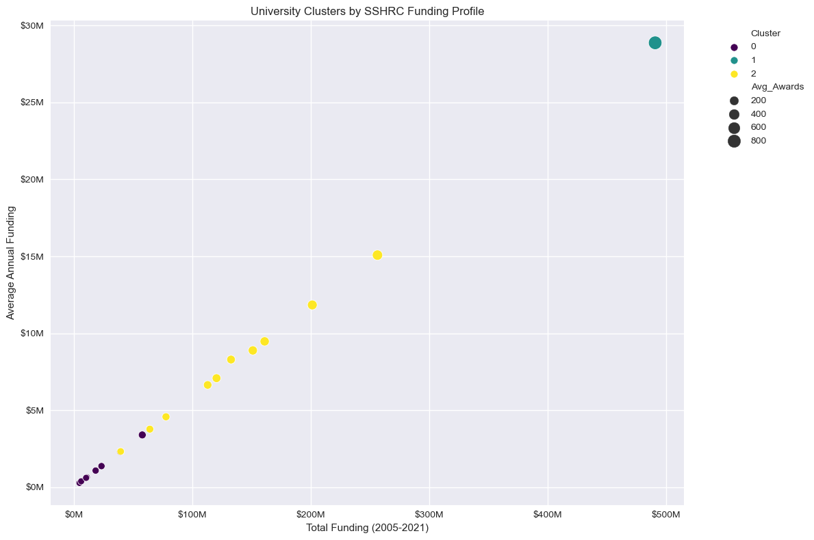
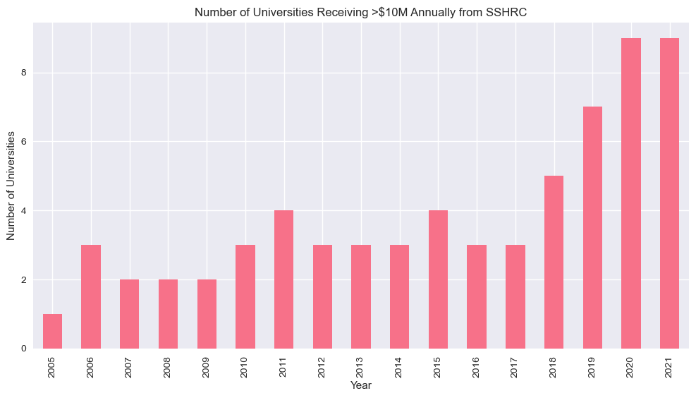

# SSHRC Research Fund Analysis

## Overview
Analysis of Social Sciences and Humanities Research Council (SSHRC) funding data from 2005-2021 for Ontario universities, examining award counts and funding amounts.

## Key Findings
- **Total Funding**: $856 million allocated across Ontario institutions
- **Top Institutions**:
  - University of Toronto
  - York University
  - University of Ottawa
- **Disciplinary Focus**:
  - 35% Sociology and Anthropology
  - 28% Education
  - 22% Business and Economics

## Methodology

### I. Time-Series Funding Trend Analysis

```python 
plot_annual_trends(df, agency="SSHRC")
```

#### Outcomes





### II. Comparative Analysis Between Institutions

```python
top_bottom_universities(df, agency="SSHRC")
```    

#### Outcomes



**SSHRC Funding Concentration Analysis:**
- Top 3 universities account for 47.9% of total funding
- Top 5 universities account for 63.7% of total funding
- Top 10 universities account for 89.3% of total funding

### III. Agency-Specific Trend Breakdown 

```python
agency_specific_analysis(df, agency="SSHRC")
```

#### Outcomes




### IV. Statistical Modeling & Forecasting

```python
funding_forecasting(df, agency="SSHRC")
```

#### Outcomes



### V. Statistical and Advanced Analysis

```python
advanced_analysis(df, agency="SSHRC")
```

#### Outcomes



### VI. Benchmarking and Efficiency Metrics

```python
efficiency_metrics(df, agency="SSHRC")
```

#### Outcomes


